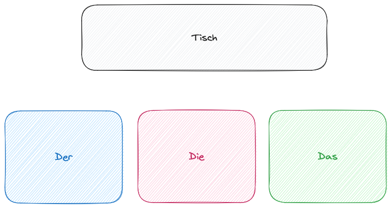

# German Flash Cards

This is a game that I am writing to learn golang. It is a flash card game. The goal is to create an application that will select 10 words at a time and quiz you on if it a der, die or das word. The words are then score based on correct or incorrect. This score is used for weighting the random chance of the word being selected in the next round. 

## Interface

The interface will be exceedingly simple. 3 choices and the work displayed above. 

# How to use
Currently it heavily under construction and something I am doing in my spare time. There currently is no how to use. 