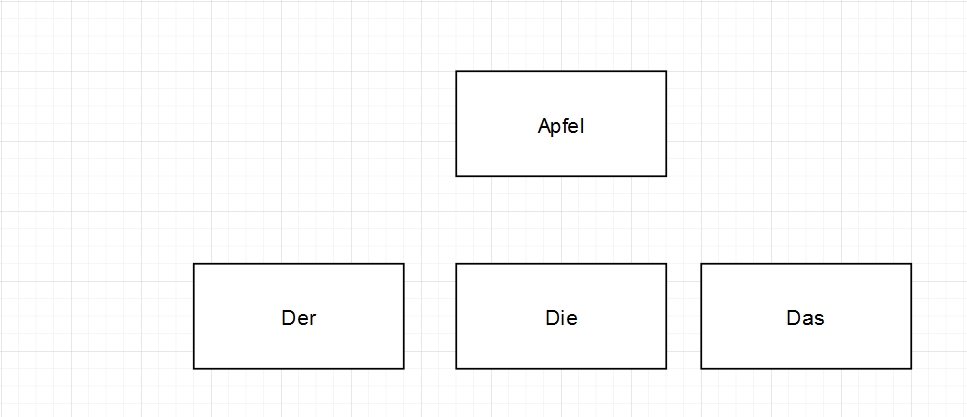

# Game Design 
 
Simple flash card game for learning German Aritcles. Der Die oder Das. 

Answer file would contain `der Apfel, the Apple` for example. Maybe as CSV. This allows as to determine if correct. `Der Die Das Apfel` is Presented like 

Then it should keep track of when you answered correctly and when you answered incorrectly, asking the user more frequently about ones that were incorrect rarly but still required to ask the correct ones again. 

Step one. 

Lets use go to call an API. https://en.wiktionary.org/w/api.php has the information we need. We can scrape the word and store word + ARTICLE. 

DE API is different
https://de.wiktionary.org/api/rest_v1/#/Page%20content

CROSS pLatform GUI APP... could also write as web app... shall seee
https://dev.to/aurelievache/learning-go-by-examples-part-7-create-a-cross-platform-gui-desktop-app-in-go-44j1

When playing the "game" how to store results and store for later so that incorrect guess are repeated more often. 

